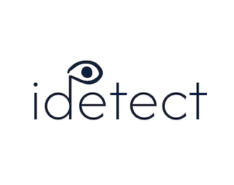

<p align="center">
  
</p>

<h1 align="center">iDetect — MLOps pipeline</h1>

<p align="center"><strong>Investor mood / approachability from face images</strong></p>

---

## Links

| | |
|---|---|
| **Repository (this project)** | [github.com/Bonaparte003/Summative-assignment---MLOP](https://github.com/Bonaparte003/Summative-assignment---MLOP) |
| **Live app (hosted)** | [Streamlit UI — http://16.170.235.209](http://16.170.235.209) · FastAPI docs: [http://16.170.235.209:8000/docs](http://16.170.235.209:8000/docs) |
| **Video demo** | [YouTube walkthrough](https://www.youtube.com/watch?v=Qit_-G2jZ_w) |
| **Prior project (Introduction to ML summative)** | [github.com/Bonaparte003/iDetect-Summative-introduction_to_machine_learning](https://github.com/Bonaparte003/iDetect-Summative-introduction_to_machine_learning) |

The hosted stack matches **Docker Compose** locally: UI on **8501** (often reverse-proxied to port **80**), API on **8000**. Open **8000** (and **8089** if you run Locust) in the instance **security group** if those URLs time out.

The earlier repository is the **introduction module** work (notebook on GitHub). **This** repository adds the pipeline: training notebook under `notebook/`, `src/`, FastAPI, Streamlit, SQLite upload log, Docker, and Locust.

---

## What this project does

**iDetect** predicts whether a face looks **approachable (1)** or **not approachable (0)** from an **image**, using folders mapped as:

- **Class 1:** `happy`, `neutral`
- **Class 0:** `anger`, `contempt`

You can **train offline** (notebook or `src/train.py`), **serve** predictions via **FastAPI**, use a **Streamlit** UI, **upload** extra images for **retraining**, and **load-test** `/predict` with **Locust**.

**Continuity with the intro course:** the full comparison experiments (classical ML + deep learning) live in **`notebook/iDetect_Project_Summative_introduction_to_machine_learning-2.ipynb`** in this repo. The public [**introduction summative** repo](https://github.com/Bonaparte003/iDetect-Summative-introduction_to_machine_learning) is the earlier standalone submission. The **pipeline notebook** (`notebook/iDetect_Project_Summative_machine_learning_pipeline.ipynb`) follows the **EfficientNetB0 fine-tuning** setup chosen there; **`src/train.py`** uses the **same architecture and preprocessing**, with a **single** `model.fit` (configurable `unfreeze_last_n`, e.g. 30) rather than two separate Colab phases.

---

## Setup (step by step)

### Prerequisites

- **Python 3.10+** (3.11 matches the `Dockerfile`)
- **Git**, **pip**
- **AffectNet** (or same layout) on disk — not bundled here by default

### 1. Clone and virtual environment

```bash
git clone https://github.com/Bonaparte003/Summative-assignment---MLOP
cd Summative-assignment---MLOP
python3 -m venv .venv
source .venv/bin/activate    # Windows: .venv\Scripts\activate
pip install -r requirements.txt
```

### 2. Dataset layout

Ensure you have the **AffectNet** dataset ([Kaggle — AffectNet](https://www.kaggle.com/datasets/mstjebashazida/affectnet)) at the **repo root**:

```text
AffectNet/
  happy/
  neutral/
  anger/
  contempt/
```

Training code **balances** classes and emotion pairs (see `src/preprocessing.py`). Optional cap: `--limit_per_emotion` (CLI) or `LIMIT_PER_EMOTION` in the pipeline notebook.

### 3. Train and produce artifacts

```bash
python -m src.train --data_dir "AffectNet" --output_dir "."
```

Or open **`notebook/iDetect_Project_Summative_machine_learning_pipeline.ipynb`**, set `DATA_DIR` / `OUTPUT_DIR`, run all cells, then copy **`idetect_classifier.keras`** into **`models/`** if you saved it elsewhere.

**Expected outputs:**

| Output | Location |
|--------|----------|
| Saved model | `models/idetect_classifier.keras` |
| Metrics + run metadata | `reports/metrics.json` |
| Model pointer for API | `reports/model_meta.json` |

### 4. Run API + UI (local)

**Terminal 1 — API**

```bash
uvicorn api.main:app --host 0.0.0.0 --port 8000
```

**Terminal 2 — UI**

```bash
streamlit run ui/app.py --server.port 8501
```

- API docs: `http://localhost:8000/docs`
- Health: `GET http://localhost:8000/health`
- Predict: `POST /predict` (multipart field **`image`**)
- Retrain flow: `POST /upload` → `POST /retrain` → `GET /job/{job_id}`

Set **`API_URL`** if Streamlit is not on the same machine as the API (default `http://localhost:8000`). On the **hosted** deployment, the UI container uses `API_URL=http://api:8000` inside Compose; for a manual EC2 setup, set `API_URL` to your public API base (e.g. `http://16.170.235.209:8000`).

### 5. Docker Compose

```bash
docker compose up --build
```

- API: **8000**, UI: **8501**
- Mount **`AffectNet`** and persist **`./data`** and **`./models`** as in `docker-compose.yml` / `Dockerfile` comments.

**API-only container example:**

```bash
docker build -t idetect-api .
docker run -p 8000:8000 \
  -e DATA_DIR=/app/AffectNet \
  -e DATABASE_PATH=/app/data/idetect_retrain.sqlite3 \
  -v "$PWD/models:/app/models" \
  -v "$PWD/data:/app/data" \
  idetect-api
```

### 6. Locust (load test)

With the API running and a folder of images available to the Locust process:

```bash
export IMAGE_PATH=AffectNet/happy
locust -f locust/locustfile.py --host http://localhost:8000
```

Open the Locust web UI (default **http://localhost:8089**), run a test, then **save or screenshot** latency stats for your coursework write-up.

---

## Example metrics (`reports/metrics.json`)

After training, `reports/metrics.json` includes test-set scores. A recent local run reported approximately:

| Metric | Example value |
|--------|----------------|
| Accuracy | ~0.93 |
| Precision | ~0.99 |
| Recall | ~0.87 |
| F1 | ~0.92 |
| ROC-AUC | ~0.98 |

Exact numbers depend on your data and run; open **`reports/metrics.json`** for the current `metrics` block and `split_sizes`.

---

## Repository layout

| Path | Purpose |
|------|---------|
| `notebook/iDetect_Project_Summative_introduction_to_machine_learning-2.ipynb` | Intro module: SVM + DL experiments + comparison |
| `notebook/iDetect_Project_Summative_machine_learning_pipeline.ipynb` | Pipeline training, evaluation, export |
| `src/preprocessing.py`, `model.py`, `prediction.py` | Data, graph, inference |
| `src/train.py` | CLI training (used by API retrain) |
| `src/retrain_db.py` | SQLite metadata for upload API |
| `api/main.py` | FastAPI |
| `ui/app.py` | Streamlit |
| `locust/locustfile.py` | HTTP load test on `/predict` |
| `data/uploads/` | Retraining images (`0/` and `1/`) |
| `data/idetect_retrain.sqlite3` | Created at runtime (gitignored) — upload audit trail |

<p align="center"><sub>iDetect — MLOps summative</sub></p>
